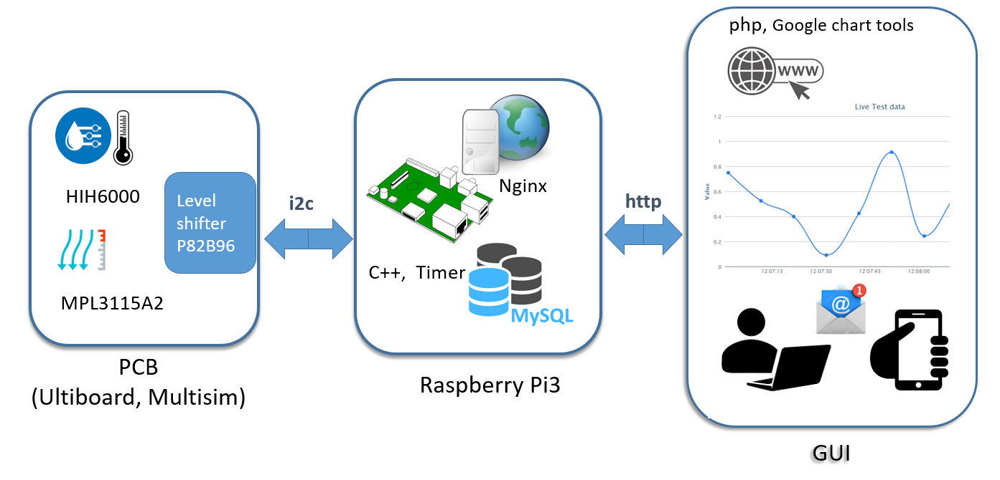

# Raspberry Pi Weather Station

This real-time local weather station project utilises a Raspberry Pi 3, off-the-shelf I2C sensors and a custom built PCB using MultiSim (National Instruments) for the circuit design and Ultiboard (National Instruments) for the PCB design. Data can be accessed online in a web app run on an Apache server (the Raspberry Pi). The data acquisition and data processing is written in C++ and the web app display is written in PHP, using a MySQL database.

Contributers:
* [Aurelie Crawford](https://github.com/acra6488/) - Electronics
* [Craig McCallum](https://github.com/craigmccallum/) - Data Acquisition and Processing
* [Damir Gulamov](https://github.com/damir2020/) - Web App Display

## Table of Contents
[Introduction](#intro)
1. [Getting Started](#start)
   1. [Raspberry Pi Setup](#raspi)
   2. [Electronics](#electro)
2. [Installation](#install)
   1. [Data Acquisition, Data Analysis and GUI](#data)
   2. [Wep App](#web)
3. [Social engagement: Twitter and YouTube](#social)

## Introduction 

We are creating a conveninent way to remotely track basic weather data (humidity, temperature and pressure) using a Raspberry Pi. The system can be used as a universal condition monitoring system. Ready-made solutions can be expensive or won't do exactly what we want. 
Our solution is programmable by the user and cheap to be manufactured by someone else reading this page. The 4 i2c sensors used had a cost of about £5.

The Raspberry PI code is written in C++. The data received by the sensors is fomatted into a MySQL database every 5 seconds. 

The web server is coded in PHP. The graphics user interface has real-time schematics and uses googles graphic tools. It is available on any device via http protocol. 

It is possible to configure email alerts for when a fast or large variation of the weather is detected.

## Getting Started 
### Raspberry Pi Setup 

We have made a homemade board that sits right on top of the Raspberry PI, that is connected to it via the GPIO interface, and kept snuggly tight with 4 M2.5 mounting screws. A second board with the sensors is placed outside and connected to the Raspberry PI with a 10-meter long RJ45 (ethernet) cable.
See our Twitter feed for pictures.
@glasgoweatherpi
https://twitter.com/glasgoweatherpi

### Electronics 
The hardware consists in a Raspberry PI 3 and two custom made printed circuit boards (PCBs) that use i2c components. One of the circuit boards is kept locally with the Raspberry PI. The second one is placed outside to do the weather measurements. The first board is therefore called "local enclosure". The second "remote enclosure". A 10-meter-long ethernet cable connects the two boards.

The components are listed here:

- P82B96TD,112 the level shifter on both circuits (remote enclosure/outside and “main/local enclosure”/inside)

- HIH6030-021-001 the humidity and temperature sensor, on the remote circuit (to be placed outside)

- MPL3115A2 the atmospheric pressure sensor, on the remote circuit

- 1-406541-5 the RJ45 Ethernet connector plug, on both circuits

- GPIO header: all pins will be soldered to the homemade board for better stability when the homemade board is plugged into the Raspberry PI, but only 4 of the connections are live: ground, voltage, clock and data (i2c protocol).

For more details on electronics, design and soldering, see the Wiki Hardware page.

Note: See the [electronics folder](01_electronics) for pictures and downloadable circuit and CAD files.

## Installation 
### Data Acquisition and Data Analysis 
Note: See the [data acquisition/processing folder](02_data_acquisition_and_processing)

### Web App 
Note: See the [web app folder](03_web_app)

## Social engagement 
### Twitter
@glasgoweatherpi
https://twitter.com/glasgoweatherpi

### YouTube
https://www.youtube.com/channel/UC4opVTRY-T7hGgP9xzcyDQA?view_as=subscriber

Note: See the [social_engagement folder](social_engagement)
